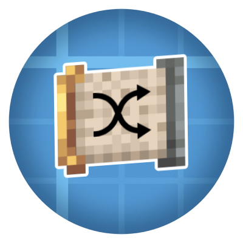

	

<!-- Version / platform badges -->

	
	
	
	
	
	

# Create Shuffle Filter

Short pitch
-----------

Add unpredictable variety to your automated builds. The Create Shuffle Filter is a lightweight mod that provides a new "Shuffle Filter" item which, when used in Create deployers or rollers on contrabtions, enables a randomnes when placing blocks. (Like the shuffle mod for players). It brings 2 filters, weighted (based on configured probability) and normal "random" (where each item gets the same probability).
The Filter works like a normal allow List filter everywhere else! 

As with Update 2.0 now even better performance and compatible with Rollers !!!

Why you'll love it
-------------------
- Randomness where you want it: choose equally between matching types or use weighted selection based on stack counts.
- No need to bring in those block mixups per hand, your contrabtion can build it now!
- Fully compatible with Create mod and addons.

Quick Features
--------------
- New items: Shuffle Filter and Weighted Shuffle Filter
- Enables shuffle mode on Create deployers and rollers on contraptions, works as normal allow list filter in all other cases.
- Two filters for 2 different modes (equal or weighted)

License
-------
This project is licensed under the MIT License. See the `LICENSE` file for details.

Credits
-------
Author: Agent772

