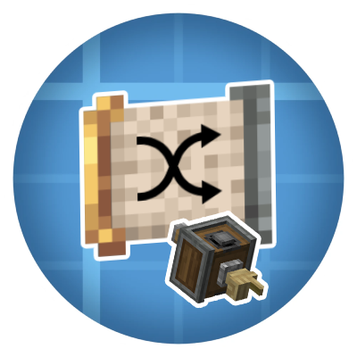

<p align="center">
	
</p>

# Create Shuffle Filter

<!-- Version / platform badges -->

<p align="center">
	
	
	
	
	
	
</p>


Short pitch
-----------

Add unpredictable variety to your builds with Create contraptions. The Create Shuffle Filter is a lightweight mod that provides a new "Shuffle Filter" item which, when used in Create deployers on contrabtions enables a randomnes when placing blocks. (Like the shuffle mod for players). It brings 2 modes, weighted based on stack quantity and normal "random", where each item gets the same chance.
The Filter works like a normal List filter everywhere else! The weighted mode = ignore nbt data, and random mode = compare nbt data in these cases.

Why you'll love it
-------------------
- Randomness where you want it: choose equally between matching types or use weighted selection based on stack counts.
- Small and focused: a single item and a small behaviour mixin — no heavy UI or complex config required.
- Fully compatible with Create mod mechanics and NeoForged/Forge environments.

Quick Features
--------------
- New item: Shuffle Filter (registers as `createshufflefilter:shuffle_filter`)
- Works with Create deployers and other filter-aware contraptions
- Two selection modes (equal or weighted) inferred from filter component data
- Preserves NBT-aware matching when required

Installation
------------
1. Place the built mod jar into your `mods/` folder for a NeoForged/Forge 1.21.1 environment.
2. Run Minecraft with Create (recommended version: Create v6.0.6-98) and the mod loader declared in `gradle.properties`.

Development / Build (for contributors)
-------------------------------------
- This repository uses Gradle with the NeoForged/ModDevGradle setup.
- Common commands (from project root on Windows PowerShell):

```powershell
./gradlew --refresh-dependencies; ./gradlew build
```

Tech stack
----------
- Java 17+ (as required by Minecraft / NeoForged tooling)
- NeoForged modloader (tooling and mod container integration)
- Create mod integration (CreateRegistrate and Create APIs)
- SpongePowered Mixin for behaviour injection
- Registrate for item registration

What it changes (implementation details)
---------------------------------------
Files of interest (high level):

- `src/main/java/com/agent772/createshufflefilter/CreateShuffleFilter.java`
	- Registers the mod, the `Shuffle Filter` item using Create's `CreateRegistrate`, and hooks registrate to the mod event bus.

- `src/main/java/com/agent772/createshufflefilter/mixins/MixinDeployerMovementBehaviour.java`
	- A Mixin targeting `DeployerMovementBehaviour.tryGrabbingItem` to intercept deployer pick logic when a Shuffle Filter is present.
	- When a shuffle filter is detected, it scans the contraption inventory for items that match the filter predicate, collects unique candidates by full item + components (NBT-aware), and picks one at random.
    - For the modes, the ignore NBT data option is hijacked.
	- Two selection modes:
		- Equal mode: each unique matching item type has equal chance.
		- Weighted mode: selection is weighted by the number of stacks of each type in the contraption storage.
	- Uses Create's `ItemHelper.extract` to take a single item from storage and places it in the deployer's fake player's main hand.

Design notes
------------
- Unique candidate detection: items are compared using `ItemStack.isSameItemSameComponents` to ensure NBT/components are respected when collecting candidates.
- Mode toggle: The mixin reads the filter item components to detect Create's `filter_items_respect_nbt` value — the implementation interprets `true` as "equal mode" and `false` as "weighted mode".
- Safety: server-side only behaviour and several null checks to avoid interfering with vanilla or Create logic when the filter isn't a Shuffle Filter.

Resources
---------
- Logo: `bin/main/shufflefilters_logo.png`
- Example registration: `CreateShuffleFilter.SHUFFLE_FILTER` in `CreateShuffleFilter.java`

Contributing
------------
- Pull requests welcome.
- Ensure consistency with Create and NeoForged mapping/licensing where required.

License
-------
This project is licensed under the MIT License. See the `LICENSE` file for details.

Credits
-------
Author: Agent772

Contact & Community
-------------------
- NeoForged Discord and Create modding communities are great places to get help and feedback.

